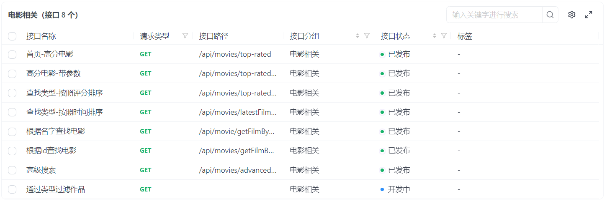
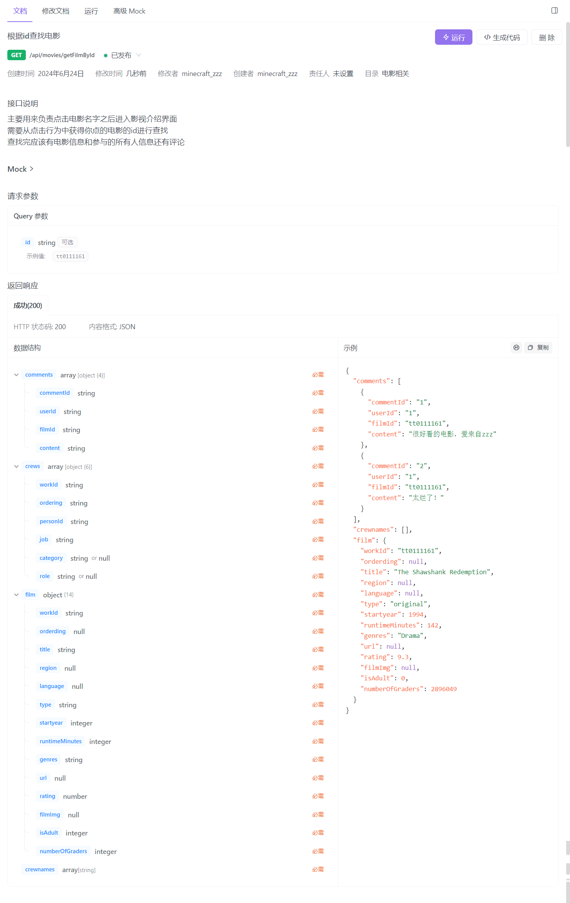

# 数据库大作业后端

### 项目描述

鉴于影视作品已成为现代生活中不可缺少的文化娱乐元素，我们开发了一个基于IMDb（影视数据库）的搜索平台。该网站允许用户（无需注册）直接搜索他们感兴趣的电影、电视剧和演员信息。用户可以轻松查阅观众评价和各种影视排行榜，获取丰富的内容和评分信息。


### 后端部署

#### 本地部署

本后端项目使用 JAVA+SpringBoot+Mybatis 实现，使用Maven进行包管理，选择IDEA作为开发工具

首先安装IDEA，并且下载jdk17，同时下载maven3.9.6导入项目，更新maven后运行即可

#### 云端部署

服务器采用华为云，操作系统Centos7.5

首先卸载Centos自带的mariadb

```shell
#查找
rpm -qa|grep mariadb
#卸载
rpm -e mariadb-libs-(版本号) --nodeps
```

将下载好的mysql安装包存到/usr/server/mysql文件夹下，将解压出来的四个文件全部安装

```shell
tar xvf mysql-8.4.0-1.el7.x86_64.rpm-bundle.tar
```

成功安装mysql后启动，修改初始密码后创建Dbfinal数据库并且使用Navicat将数据导入

```shell
#启动mysq1
systemctl start mysqld.service
#授予远程连接权限
grant all privileges on *.* to 'root' @'%' identified by 'root';
#刷新
flush privileges;
#mysq1的启动和关闭 状态查看
systemctl stop mysqld
systemctl status mysqld
systemctl start mysqld
#建议设置为开机自启动服务
systemctl enable mysqld
#查看是否已经设置自启动成功
systemctl list-unit-files grep mysqld
```

下载 jdk17，和mysql一样解压安装，编辑/etc/profile把JAVA添加到环境变量，将写好的程序通过maven打包并部署至服务器

由于springboot内置有tomcat容器，省去了tomcat的部署

```shell
#启动服务，并且输出日志到文件
nohup java -jar DbcourseFinalProject-0.0.1-SNAPSHOT.jar  > logName.log 2>&1 &
```

至此后端部署已经完成


### 项目介绍

```
─dbcoursefinalproject
    │  DbcourseFinalProjectApplication.java
    │
    ├─config
    │      CorsConfig.java	主要为了解决跨域问题
    │
    ├─controller 	控制器层：负责处理 HTTP 请求
    │      FilmController.java	负责处理电影相关请求
    │      PrincipalController.java 负责处理人员相关请求
    │      UserController.java	负责处理用户相关请求
    │
    ├─entity	对应于数据库中各个表的对象
    │      Comment.java
    │      Crew.java
    │      Film.java
    │      Principal.java
    │      User.java
    │
    ├─mapper	存放数据库函数，用来与数据库交互
    │      FilmMapper.java
    │      PrincipalMapper.java
    │      UserMapper.java
    │
    ├─service	业务逻辑层，完成功能的设计，但在本项目中几乎没有用到
    │      FilmService.java
    │      PrincipalService.java
    │      UserService.java
    │
    └─util	本来打算作为统一的结果返回类，但是后来发现JsonObject更好用
            GlobalResult.java
```

### 后端功能展示






### 项目备注/参考资料

[19.SpringBoot+Vue云端环境配置_哔哩哔哩_bilibili](https://www.bilibili.com/video/BV1nV4y1s7ZN?p=19&vd_source=5ac351d2aef4380e58cd6efefbdcb0e3)

[跨域CORS解决办法_前端cors解决跨域-CSDN博客](https://blog.csdn.net/qq_45406325/article/details/125197576)

[Springboot 四层框架_springboot四层-CSDN博客](https://blog.csdn.net/WEB___/article/details/123766304)


